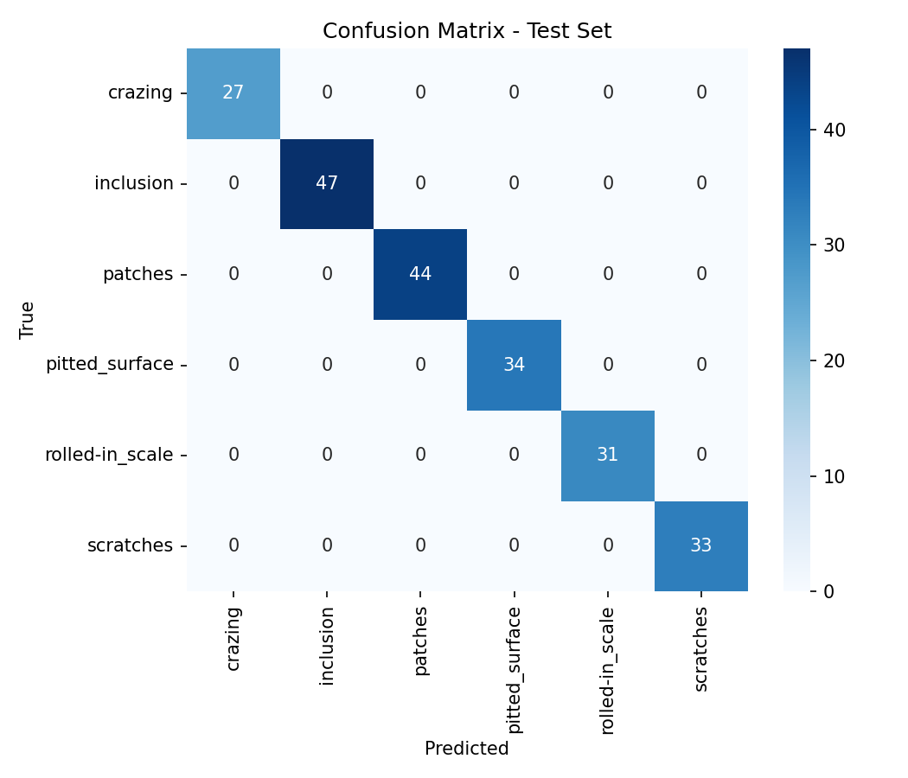
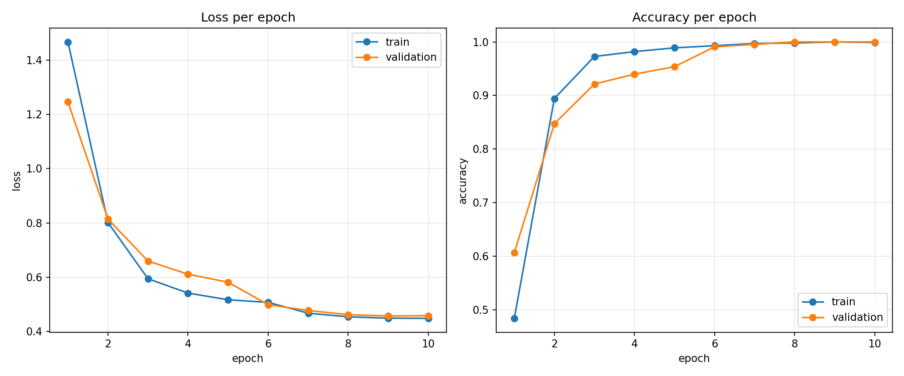
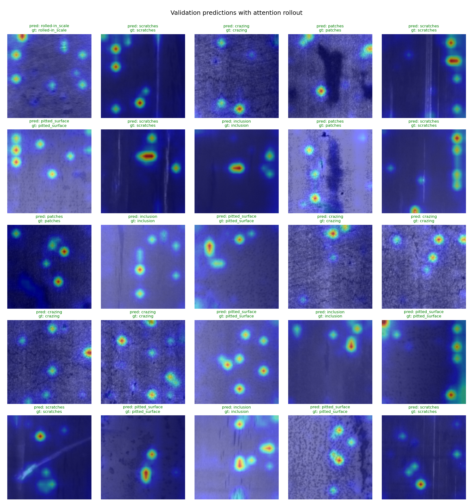

# Steel Surface Defect Classification (ViT)

Fine-tunes a Vision Transformer to sort photos of steel surfaces into the six
NEU defect categories, then ships the trained model as an ONNX file you can run
without dragging PyTorch along. I wanted this to look like something you could
drop next to a production line, not a one-off notebook, so the training,
export, explainability and deployment pieces are all separate and scriptable.

## What it does

You give it an image of a steel surface and it tells you which kind of defect
it is, with a confidence score for each class. Training uses PyTorch and timm;
everything after that (serving, quantisation) runs on the exported ONNX file so
production doesn't need the training stack. Point it at a different folder of
images and it retrains on those instead, so it isn't tied to this one dataset.

## The dataset

[NEU Surface Defect Database](https://www.kaggle.com/datasets/kaustubhdikshit/neu-surface-defect-database):
1,800 grayscale images at 200x200, 300 per class, six defect types.

| Class | What it looks like |
|---|---|
| `crazing` | A network of fine surface cracks |
| `inclusion` | Foreign material stuck in the surface |
| `patches` | Localised discoloured regions |
| `pitted_surface` | Small cavities and pitting |
| `rolled-in_scale` | Scale pressed in during rolling |
| `scratches` | Straight mechanical scratches |

## Results

Every run drops its numbers in `results/metrics.json` and writes three figures
to `results/`: the confusion matrix, the loss and accuracy curves per epoch, and
a 5x5 grid of validation predictions with attention overlays.

| Model | Params | Test accuracy | Macro-F1 |
|---|---|---|---|
| `vit_small_patch16_224` | ~22M | 100.0% | 1.000 |

Confusion matrix on the held-out test set:



Train vs. validation loss and accuracy per epoch:



Validation predictions with attention-rollout overlays (prediction / ground
truth on each tile):



## How the training works

Training happens in two stages. First it trains only the classifier head with
the pretrained backbone frozen, then it unfreezes everything and continues with
a much smaller learning rate on the backbone. Starting frozen is a lot more
stable on a small dataset than throwing the whole network into the fire on step
one.

A few other things worth mentioning: it keeps an EMA (exponential moving
average) copy of the weights and saves whichever of the two scores better on
validation; it can weight the classes inversely to their frequency if your data
is unbalanced; it uses label smoothing, a warmup plus cosine learning-rate
schedule, mixed precision on CUDA, and early stopping. The train/val/test split
is seeded so runs are reproducible. All the knobs live in
`configs/config.yaml`, not in the code.

On top of the metrics, each run saves loss and accuracy curves (train vs
validation, per epoch) and a 5x5 grid of validation images with the attention
heatmap, the predicted class and the ground truth on every tile, so you can
eyeball what the model got right and where it slipped.

## Project layout

```
neu-defect-classifier/
├── configs/config.yaml         # every hyperparameter lives here
├── src/
│   ├── data.py                 # datasets, transforms, class weights
│   ├── model.py                # ViT factory, freeze/unfreeze, EMA
│   ├── train.py                # two-stage training + test report
│   ├── export_onnx.py          # checkpoint -> ONNX, with a correctness check
│   ├── predict.py              # ONNX-only inference (no PyTorch)
│   ├── explain.py              # attention-rollout heatmaps
│   └── quantize_onnx.py        # INT8 quantisation
├── results/                    # metrics, confusion matrix, heatmaps (git-ignored)
├── docs/                       # figures embedded in this README
├── Dockerfile                  # small inference image
├── requirements.txt            # training / export
└── requirements-inference.txt  # production runtime (onnxruntime only)
```

## Running it

```bash
pip install -r requirements.txt

# Grab the dataset from Kaggle and lay it out as one folder per class:
#   data/NEU-CLS/<class_name>/*.bmp   (path is set in configs/config.yaml)

# Train. Writes checkpoints/ and results/.
python -m src.train --config configs/config.yaml

# Export the best checkpoint to ONNX.
python -m src.export_onnx \
    --checkpoint checkpoints/best_model.pt \
    --output neu_defect_vit.onnx \
    --dynamic-batch
```

## Seeing where the model looks

`explain.py` produces an attention-rollout heatmap. It reads the attention
weights out of every transformer block, folds them together, and paints the
patches the model relied on back onto the image. If the hot region sits on the
actual defect, the operator has a reason to trust the call.

```bash
python -m src.explain \
    --checkpoint checkpoints/best_model.pt \
    --image sample.bmp \
    --output results/attention.png
```

It prints the predicted class and saves the overlay to `results/`.

## Serving with ONNX

The exported model carries its own class names, image size and normalisation
constants inside the `.onnx` file as metadata, so the serving code stays short
and can't drift out of sync with training. Inference only needs `onnxruntime`,
`numpy` and `pillow`.

```bash
python -m src.predict --onnx neu_defect_vit.onnx --image sample.bmp --topk 3
```

```
scratches           98.71%
inclusion            0.87%
patches              0.31%
```

Or call it from your own service:

```python
from src.predict import DefectClassifier

clf = DefectClassifier("neu_defect_vit.onnx")
top = clf.predict("part_1234.bmp", topk=1)[0]
if top["confidence"] > 0.9:
    reject_part(top["class"])
```

## Making it smaller (INT8)

For edge boxes or cheap CPUs, `quantize_onnx.py` converts the model to 8-bit
integers with **static (calibrated) quantisation** — about 4x smaller and faster
on CPU. Both weights and activations are quantised using ranges measured on a
folder of real images, so you point it at a set of representative samples (one
sub-folder per class). Class metadata is copied across, so the quantised file
works with `predict.py` unchanged.

```bash
python -m src.quantize_onnx \
    --input neu_defect_vit.onnx \
    --output neu_defect_vit.int8.onnx \
    --calib-dir data/NEU-CLS --num-calib 100

python -m src.predict --onnx neu_defect_vit.int8.onnx --image sample.bmp
```

Quantisation is lossy, so re-check accuracy on your test set after quantising
before shipping the INT8 model.

## Docker

The `Dockerfile` builds a slim inference image on top of `python:3.11-slim`.
It installs only the runtime dependencies (`onnxruntime`, `numpy`, `pillow`),
copies in `src/` and the `.onnx` model, and sets `predict.py` as the entrypoint.
Because PyTorch never enters the image, it lands around 200 MB instead of the
several GB a training image would need.

Export a model first (that `.onnx` gets baked into the image), then:

```bash
docker build -t neu-defect .

# classify an image from a mounted folder
docker run --rm -v $(pwd)/samples:/samples \
    neu-defect --onnx neu_defect_vit.onnx --image /samples/test.bmp --json
```

Running the container with no arguments prints the CLI help. Swap in
`neu_defect_vit.int8.onnx` if you built the quantised model and want the
smaller footprint.

## Checkpoint contents

The saved `.pt` holds everything needed to reload or export the model:

```python
{
    "model": state_dict,
    "used_ema": True/False,
    "best_val_acc": 0.99,
    "epoch": 18,
    "classes": ["crazing", "inclusion", ...],
    "img_size": 224,
    "model_name": "vit_small_patch16_224",
}
```
